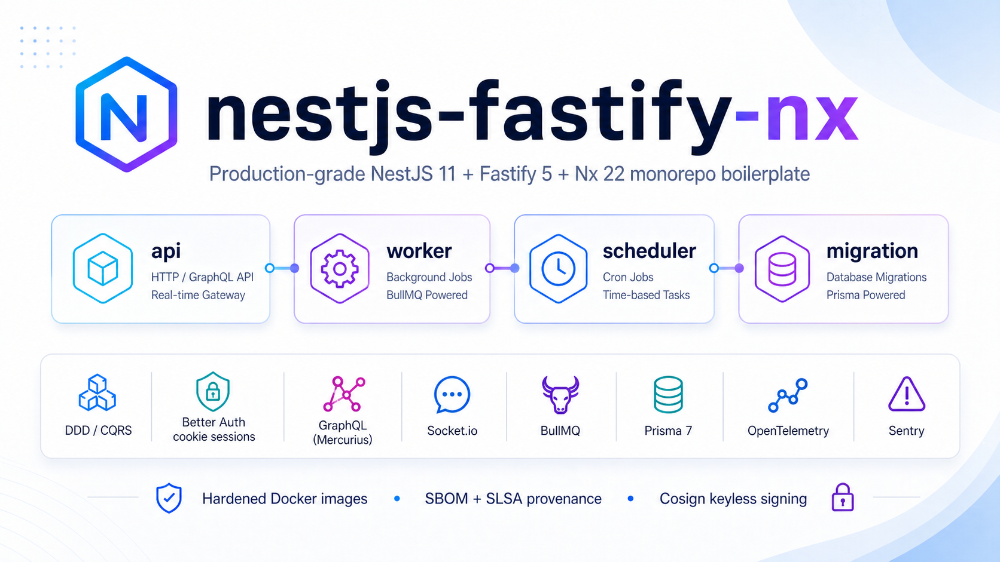

<div align="center">
  
</div>

<h1 align="center">nestjs-fastify-nx</h1>

<p align="center">
  <strong>Production-grade NestJS 11 + Fastify 5 + Nx 22 monorepo boilerplate.</strong><br/>
  DDD · CQRS · Better Auth · GraphQL · Socket.io · BullMQ · OpenTelemetry · Sentry — wired and tested.
</p>

<p align="center">
  <a href="https://github.com/chuanghiduoc/nestjs-fastify-nx/actions/workflows/ci.yml"></a>
  <a href="https://github.com/chuanghiduoc/nestjs-fastify-nx/actions/workflows/release.yml"></a>
  <a href="https://github.com/chuanghiduoc/nestjs-fastify-nx/releases/latest"></a>
  <a href="LICENSE"></a>
  <a href="https://github.com/chuanghiduoc/nestjs-fastify-nx/stargazers"></a>
  <a href="https://github.com/chuanghiduoc/nestjs-fastify-nx/issues"></a>
  <a href="https://github.com/chuanghiduoc/nestjs-fastify-nx/commits/main"></a>
</p>

<p align="center">
  
  
  
  
  
  
  
  
  
  
  
  
</p>

<p align="center">
  <a href="#quick-start">Quick Start</a> ·
  <a href="#why-this-boilerplate">Why this boilerplate?</a> ·
  <a href="#architecture">Architecture</a> ·
  <a href="docs/getting-started.md">Documentation</a> ·
  <a href="#contributing">Contributing</a>
</p>

---

## Table of Contents

- [Why this boilerplate?](#why-this-boilerplate)
- [Highlights](#highlights)
- [Stack](#stack)
- [Architecture](#architecture)
- [Quick Start](#quick-start)
- [Common Commands](#common-commands)
- [Project Layout](#project-layout)
- [Security](#security)
- [Observability](#observability)
- [Testing](#testing)
- [Release & Deployment](#release--deployment)
- [Documentation](#documentation)
- [Contributing](#contributing)
- [Acknowledgements](#acknowledgements)
- [License](#license)

## Why this boilerplate?

Most NestJS starters stop at "hello world + auth". This one ships the parts you actually rewrite on every project:

- **Real DDD layout** with module-boundary lint rules (`@nx/enforce-module-boundaries`) so cross-context imports fail in CI, not in code review.
- **Cookie-session auth** (Better Auth + argon2) reused on REST, GraphQL **and** Socket.io — no JWT, no refresh-token plumbing.
- **Stripe-style + RFC 9457 contract** — 2xx returns the resource directly, errors are `application/problem+json` with stable `code`s and a flat `errors[]` for both validation and business-rule failures, every response carries an `X-Request-Id` for log/trace correlation.
- **Three API surfaces on one Fastify instance** — REST/OpenAPI, GraphQL (Mercurius), and WebSockets — with Redis pub/sub for horizontal scale.
- **Background processing** wired correctly: BullMQ + Bull Board UI behind admin auth, transactional outbox so domain events survive crashes.
- **Day-2 observability** out of the box: OpenTelemetry traces, Sentry errors + profiling, Prometheus `/metrics`, structured pino logs with request-id correlation.
- **Hardened production images** — pinned by SHA256 digest, non-root, tini PID 1, Node-only healthchecks, no shell utilities.
- **Five-layer security pipeline** — Gitleaks · OSV-Scanner · Semgrep · Trivy · Cosign keyless — running locally **and** gating CI/release.
- **Real integration tests** — Vitest + Testcontainers (Postgres + Redis) means "the test passed" actually means "it works".

If you've ever shipped a Node service to production, you've written this code already. Now you don't have to.

## Highlights

- **Four runnable services** — `api`, `worker`, `scheduler`, `migration` — sharing a single Nx workspace and one pnpm lockfile.
- **DDD + CQRS layout** with bounded contexts under `libs/modules/*`, infrastructure adapters under `libs/infra/*`, cross-cutting plumbing under `libs/core/*`.
- **Better Auth (cookie sessions, argon2)** with WebSocket session reuse via a custom Socket.io adapter.
- **REST (OpenAPI/Swagger) + GraphQL (Mercurius) + Socket.io** all running on the same Fastify instance, with Redis pub/sub for cross-pod broadcast.
- **BullMQ + Bull Board** UI mounted behind admin auth; transactional outbox pattern wires domain events to durable jobs.
- **OpenTelemetry + Sentry + Prometheus `/metrics`** — traces, errors, and Prometheus-scrapeable metrics out of the box.
- **Production Dockerfiles** pinned by SHA256 digest, non-root, tini PID 1, npm CLI vendored stripped, healthchecks via Node `http`.
- **Five-layer security pipeline** — Gitleaks, OSV-Scanner, Semgrep, Trivy, Cosign — running both locally (`scripts/security/scan-all.sh`) and in CI.
- **Code generation** — Orval emits a typed REST client into `libs/api-client` from the live OpenAPI spec.
- **Test stack** — Vitest 4 + Testcontainers (Postgres, Redis) for real-DB integration tests; Supertest for HTTP.

## Stack

| Layer          | Technology                                                         |
| -------------- | ------------------------------------------------------------------ |
| Runtime        | Node.js 22, pnpm 10.33, TypeScript 6                               |
| Framework      | NestJS 11 + Fastify 5                                              |
| ORM            | Prisma 7 (driver adapter `@prisma/adapter-pg`)                     |
| Database       | PostgreSQL 18 (native `uuidv7()`, async I/O via io_uring)          |
| Cache          | Redis 8 + `cache-manager` + Keyv                                   |
| Queues         | BullMQ + `@nestjs/bullmq`, Bull Board UI                           |
| Authentication | Better Auth 1.6 (cookie sessions, argon2)                          |
| API surfaces   | REST (`@nestjs/swagger`), GraphQL (`@nestjs/mercurius`), Socket.io |
| Realtime       | Socket.io 4 + `@socket.io/redis-adapter`                           |
| Object storage | AWS S3 SDK v3 + presigned URLs (MinIO compatible in dev)           |
| Email          | Nodemailer (SMTP) — Mailpit in dev                                 |
| Validation     | Zod 4 + class-validator + class-transformer                        |
| Observability  | OpenTelemetry SDK + Sentry NestJS + Prometheus (`prom-client`)     |
| Logging        | nestjs-pino (structured JSON, pino-http)                           |
| Scheduling     | `@nestjs/schedule` + cron in the dedicated `scheduler` app         |
| Monorepo       | Nx 22 (`@nx/nest`, `@nx/webpack`, `@nx/vite`, `@nx/vitest`)        |
| Bundler        | Webpack 5 (NestJS-correct decorator metadata via `tsc` compiler)   |
| Test runner    | Vitest 4 + Testcontainers + Supertest                              |
| API codegen    | Orval 8 → `libs/api-client`                                        |
| Lint / format  | ESLint 10 + typescript-eslint, Prettier 3.6                        |
| Git hygiene    | Lefthook + commitlint (Conventional Commits)                       |
| Container      | Multi-stage Alpine, Buildx, SBOM + SLSA provenance                 |
| Security       | Gitleaks + OSV-Scanner + Semgrep + Trivy + Cosign                  |
| CI / CD        | GitHub Actions, GHCR, Coolify webhook                              |

## Architecture

```
┌──────────────────────────────────────────────────────────────────────────┐
│                          apps (deployable units)                         │
│                                                                          │
│  ┌──────────┐   ┌──────────┐   ┌────────────┐   ┌────────────┐           │
│  │   api    │   │  worker  │   │ scheduler  │   │ migration  │           │
│  │ Fastify  │   │ BullMQ   │   │ cron jobs  │   │ prisma ↑   │           │
│  └────┬─────┘   └────┬─────┘   └─────┬──────┘   └─────┬──────┘           │
│       │              │               │                │                  │
└───────┼──────────────┼───────────────┼────────────────┼──────────────────┘
        │              │               │                │
┌───────┴──────────────┴───────────────┴────────────────┴──────────────────┐
│                           libs (shared modules)                          │
│                                                                          │
│  modules/  bounded contexts (users, audit-log, …)                        │
│  core/     cross-cutting: auth, errors, validation, events, outbox       │
│  infra/    adapters: prisma, redis, bullmq, s3, mailer, otel             │
│  contracts/ DTOs, GraphQL schema, OpenAPI types                          │
│  shared/   pure utilities, types, constants                              │
│  testing/  test harnesses, fixtures, Testcontainers helpers              │
│  api-client/ generated REST client (Orval output)                        │
└──────────────────────────────────────────────────────────────────────────┘
```

See [docs/architecture.md](docs/architecture.md) for the full module map.

## Quick Start

> **Prerequisites** — Docker 24+, Node 22, pnpm 10.33 (`corepack enable && corepack prepare pnpm@10.33.0 --activate`).

```bash
git clone https://github.com/chuanghiduoc/nestjs-fastify-nx.git
cd nestjs-fastify-nx
cp .env.example .env
pnpm install                    # generates Prisma client via postinstall

./scripts/doctor.sh             # verify prerequisites (Docker, Node, pnpm, ports)
./scripts/build-dev.sh          # builds + starts the dev stack (MinIO bucket auto-created)
```

When done:

```bash
./scripts/teardown.sh           # stop stack + remove volumes
./scripts/teardown.sh --keep-volumes  # stop stack, keep data
```

Optional — local observability (Prometheus · Grafana · Jaeger · OTel collector):

```bash
./scripts/build-dev.sh --with-obs
# Grafana:    http://localhost:3001  (admin / admin)
# Jaeger:     http://localhost:16686
# Prometheus: http://localhost:9090
```

> Enable in `.env`: `OTEL_ENABLED=true`, `OTEL_EXPORTER_OTLP_ENDPOINT=http://otel-collector:4318`,
> `ENABLE_METRICS=true`, `METRICS_ALLOW_CIDRS=172.0.0.0/8`

Once the stack is up:

| Service          | URL                                                                                |
| ---------------- | ---------------------------------------------------------------------------------- |
| API health       | [http://localhost:3000/api/v1/health](http://localhost:3000/api/v1/health)         |
| API Docs         | [http://localhost:3000/docs](http://localhost:3000/docs) (Scalar, dev only)        |
| GraphQL endpoint | [http://localhost:3000/graphql](http://localhost:3000/graphql) (POST queries here) |
| GraphiQL IDE     | [http://localhost:3000/graphiql](http://localhost:3000/graphiql) (dev only)        |
| Bull Board       | [http://localhost:3000/api/admin/queues](http://localhost:3000/api/admin/queues)   |
| Prometheus       | [http://localhost:3000/metrics](http://localhost:3000/metrics)                     |
| MinIO console    | [http://localhost:9001](http://localhost:9001)                                     |
| Mailpit (SMTP)   | [http://localhost:8025](http://localhost:8025)                                     |

For deeper setup steps see [docs/getting-started.md](docs/getting-started.md).

## Common Commands

```bash
# Workspace
pnpm nx graph                       # interactive dependency graph
pnpm nx affected -t lint test build # run only affected projects (CI parity)
pnpm nx run-many -t test            # all projects

# Single project
./scripts/dev.sh                    # hot reload: infra in Docker + api on host (nx watch + serve)
pnpm nx serve api                   # build once then spawn Node (@nx/js:node, no HMR)
pnpm nx test api                    # vitest
pnpm nx build api --configuration=production

# Database
pnpm prisma migrate dev             # create + apply a new migration
pnpm prisma studio                  # browse data
node prisma/seed.mjs                # seed admin

# API codegen (consumes the live spec)
pnpm codegen:full                   # export OpenAPI → orval → libs/api-client

# Security (full stack — see docs/security.md)
./scripts/security/scan-all.sh
```

## Project Layout

```
.
├── apps/
│   ├── api/          # HTTP + GraphQL + WebSocket entrypoint
│   ├── worker/       # BullMQ consumer
│   ├── scheduler/    # cron jobs
│   └── migration/    # one-shot prisma migrate deploy
├── libs/
│   ├── api-client/   # Orval-generated REST client
│   ├── contracts/    # DTOs, OpenAPI types, GraphQL SDL
│   ├── core/         # auth, errors, events, outbox, validation
│   ├── infra/        # prisma, redis, bullmq, s3, mailer, otel
│   ├── modules/      # bounded contexts (users, audit-log, upload)
│   ├── composition/  # cross-cutting aggregators (admin — scope:composition)
│   ├── shared/       # framework-agnostic utilities
│   └── testing/      # test harnesses + fixtures
├── docker/           # compose.yml + compose.dev.yml + compose.prod.yml
├── prisma/           # schema, migrations, seed
├── scripts/
│   ├── build-dev.sh          # build + start dev stack (--with-obs flag)
│   ├── dev.sh                # hot reload: infra in Docker + app on host (nx watch + serve)
│   ├── build-prod.sh         # build production images with SBOM + provenance
│   ├── doctor.sh             # preflight: Docker, Node, pnpm, ports, .env
│   ├── teardown.sh           # stop stack + optional volume removal
│   └── security/             # gitleaks / osv / semgrep / trivy / cosign
├── docs/             # architecture, deployment, security, runbook, code-standards
└── .github/workflows # ci.yml, integration.yml, release.yml
```

## Security

Defense-in-depth across five layers — every layer runs locally and gates CI:

| Layer          | Tool          | Local                             | CI                            |
| -------------- | ------------- | --------------------------------- | ----------------------------- |
| Secrets        | Gitleaks      | lefthook pre-commit + pre-push    | `ci.yml` (`secret-scan`)      |
| Dependencies   | OSV-Scanner   | `scripts/security/scan-deps.sh`   | `ci.yml` (`dep-scan`)         |
| SAST           | Semgrep       | `scripts/security/scan-sast.sh`   | `release.yml`                 |
| Container CVEs | Trivy         | `scripts/security/scan-images.sh` | `release.yml`                 |
| Supply chain   | Cosign + SLSA | `scripts/security/sign-images.sh` | `release.yml` (sign + attest) |

Production images are signed with **keyless OIDC via Sigstore Fulcio**, ship with **SBOM + max-mode SLSA provenance** attestations, and the `release.yml` deploy step is gated on every scanner above. Run the full local audit with `./scripts/security/scan-all.sh`.

Container hardening: pinned base by SHA256 digest, non-root UID 1001, `STOPSIGNAL SIGTERM`, tini PID 1, healthchecks via Node `http` (no wget), npm CLI vendored stripped from the runtime layer. See [docs/security.md](docs/security.md) for the full inventory.

Found a vulnerability? Please report it privately via [GitHub Security Advisories](https://github.com/chuanghiduoc/nestjs-fastify-nx/security/advisories/new) — see [SECURITY.md](.github/SECURITY.md).

## Observability

- **Traces** — OpenTelemetry SDK with auto-instrumentations; OTLP HTTP exporters.
- **Errors** — Sentry NestJS integration + profiling-node (continuous profiler).
- **Metrics** — Prometheus exposition at `/metrics` via `prom-client`; default Node + HTTP request histograms wired in.
- **Logs** — pino structured JSON, request-id correlation, automatic redaction of `cookie` / `authorization` headers.

## Testing

| Layer       | Tool                    | Where                                 |
| ----------- | ----------------------- | ------------------------------------- |
| Unit        | Vitest 4                | `*.spec.ts` next to source            |
| Integration | Vitest + Testcontainers | uses real Postgres + Redis containers |
| HTTP / e2e  | Supertest               | `apps/api/e2e/`                       |

Run a focused subset:

```bash
pnpm nx test api                     # one project
pnpm nx affected -t test             # only what your branch changed
pnpm nx run-many -t test --parallel=3
```

## Release & Deployment

```bash
git tag v1.2.3 && git push origin v1.2.3
```

Triggers `release.yml`, which:

1. Builds + pushes 4 images to GHCR with SBOM + SLSA provenance.
2. Signs each image with Cosign (keyless Fulcio OIDC).
3. Gates on Trivy (HIGH/CRITICAL, fixable only) + Semgrep (ERROR).
4. Runs the migration container against the production DB.
5. Hits the Coolify webhook to roll out the new tag.

Verify a published tag locally:

```bash
COSIGN_IDENTITY="https://github.com/chuanghiduoc/nestjs-fastify-nx/.github/workflows/release.yml@refs/tags/v1.2.3" \
IMAGE_NAMESPACE="chuanghiduoc/nestjs-fastify-nx" IMAGE_TAG="v1.2.3" \
./scripts/security/sign-images.sh verify
```

Full flow: [docs/deployment.md](docs/deployment.md).

## Documentation

- [Getting Started](docs/getting-started.md) — local setup, tooling, common gotchas
- [Architecture](docs/architecture.md) — module map, boundaries, dataflow
- [Creating a Module](docs/creating-a-module.md) — DDD/CQRS scaffold walkthrough
- [Environment Variables](docs/environment.md) — every env var, defaults, validation
- [Deployment](docs/deployment.md) — Docker, GHCR, Coolify, migrations
- [Security Scanning](docs/security.md) — five-layer pipeline, local + CI parity
- [Troubleshooting](docs/troubleshooting.md) — known issues, debug tips
- [Runbook](docs/runbook.md) — ops runbook: health, metrics, outbox, BullMQ, performance
- [Code Standards](docs/code-standards.md) — logging, error handling, DTOs, boundary rules
- [API Reference](http://localhost:3000/docs) (Scalar, dev only)

## Contributing

Contributions are very welcome — bug reports, feature requests, and pull requests. Please:

1. Fork → feature branch from `main`.
2. Use [Conventional Commits](https://www.conventionalcommits.org/) — enforced by commitlint (`feat:`, `fix:`, `refactor:`, `docs:`, …).
3. Lefthook runs lint-staged + Gitleaks on commit; full Gitleaks history scan on push.
4. CI must be green: lint, typecheck, unit tests, build, secret + dep scans.
5. Open a PR — describe the _why_, link the issue, include a test plan.

See [CONTRIBUTING.md](CONTRIBUTING.md) for the full workflow, and [SECURITY.md](.github/SECURITY.md) for vulnerability disclosure.

## Acknowledgements

Built on the work of these open-source projects — please consider supporting them:

- [NestJS](https://nestjs.com/) · [Fastify](https://fastify.dev/) · [Nx](https://nx.dev/)
- [Prisma](https://www.prisma.io/) · [BullMQ](https://docs.bullmq.io/) · [Better Auth](https://www.better-auth.com/)
- [Vitest](https://vitest.dev/) · [Testcontainers](https://node.testcontainers.org/) · [Supertest](https://github.com/ladjs/supertest)
- [OpenTelemetry](https://opentelemetry.io/) · [Pino](https://getpino.io/) · [Sentry](https://sentry.io/)
- [Sigstore](https://www.sigstore.dev/) · [Trivy](https://trivy.dev/) · [Semgrep](https://semgrep.dev/) · [OSV-Scanner](https://google.github.io/osv-scanner/) · [Gitleaks](https://gitleaks.io/)

## Star History

<a href="https://star-history.com/#chuanghiduoc/nestjs-fastify-nx&Date">
  <picture>
    <source media="(prefers-color-scheme: dark)" srcset="https://api.star-history.com/svg?repos=chuanghiduoc/nestjs-fastify-nx&type=Date&theme=dark" />
    <source media="(prefers-color-scheme: light)" srcset="https://api.star-history.com/svg?repos=chuanghiduoc/nestjs-fastify-nx&type=Date" />
    
  </picture>
</a>

## License

Released under the [MIT License](LICENSE) — see the file for details.

<p align="center">
  <sub>Built with care by <a href="https://github.com/chuanghiduoc">@chuanghiduoc</a> · If this saved you a week of plumbing, give it a ⭐</sub>
</p>
