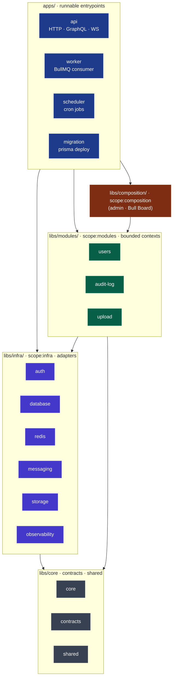
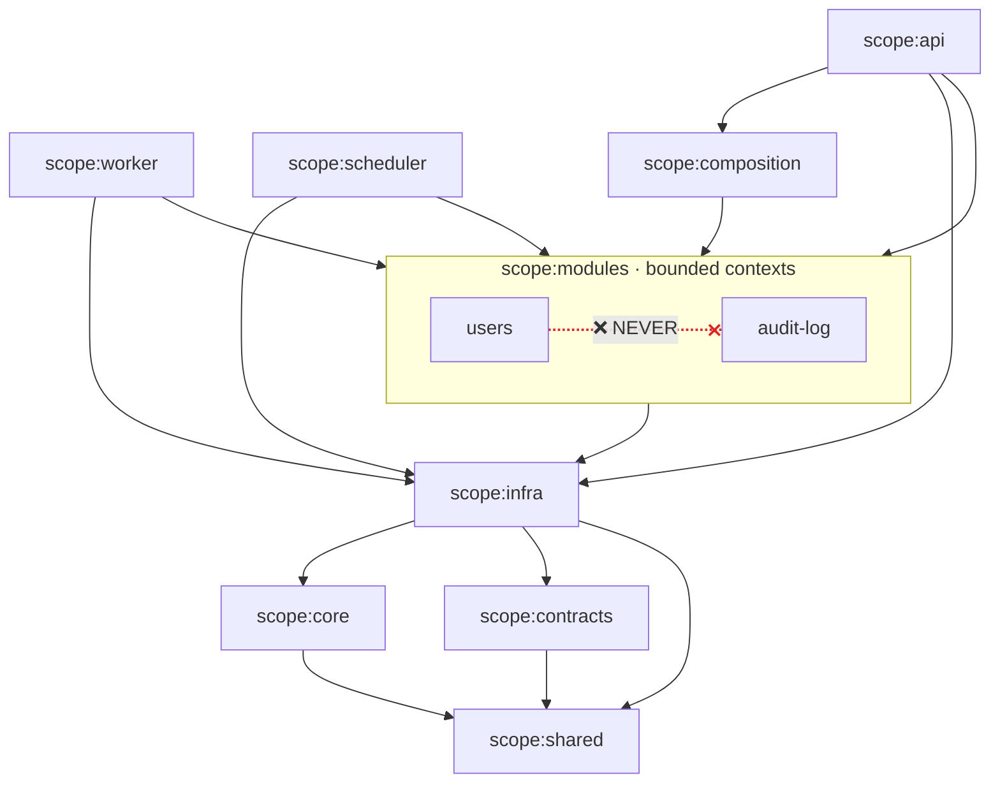
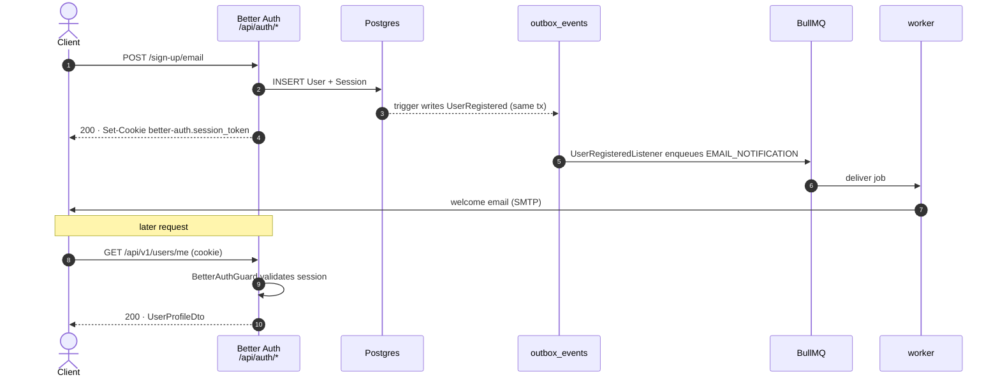
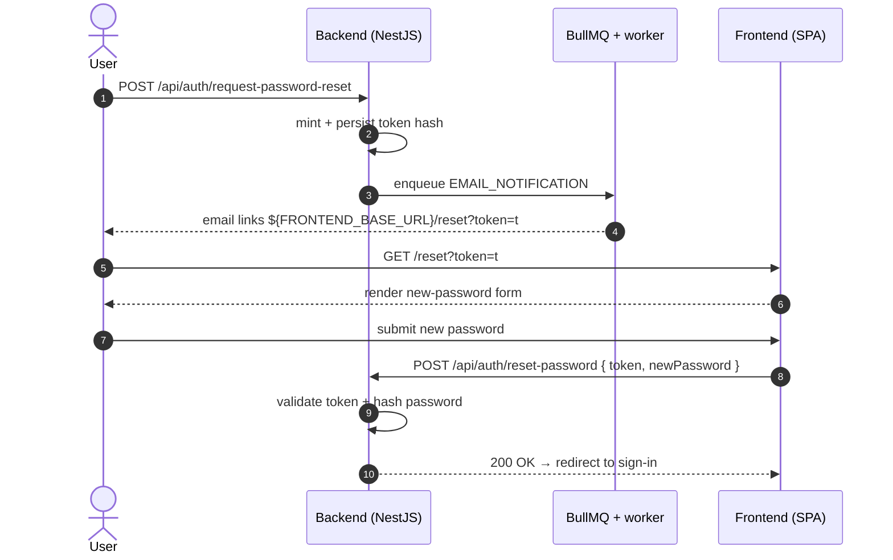
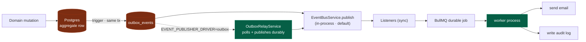
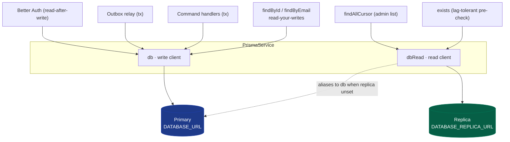

# Architecture

## Monorepo Structure

```
nestjs-fastify-nx/
├── apps/
│   ├── api/          # HTTP + GraphQL + WebSocket entrypoint (NestJS + Fastify)
│   ├── worker/       # BullMQ consumer
│   ├── scheduler/    # Scheduled tasks (@nestjs/schedule)
│   └── migration/    # One-shot prisma migrate deploy + optional seed
├── libs/
│   ├── modules/      # Bounded contexts (DDD)
│   │   ├── users/        # scope:modules — user profile, session lookup
│   │   ├── audit-log/    # scope:modules — domain-event listener writes audit rows
│   │   └── upload/       # scope:modules — multipart handler, file processing
│   ├── composition/   # Cross-cutting aggregators (scope:composition)
│   │   └── admin/     # admin surface + Bull Board (scope:composition tag; composed into api)
│   ├── infra/        # Adapters
│   │   ├── auth/         # Better Auth integration, BetterAuthGuard, RolesGuard
│   │   ├── database/     # Prisma service + module
│   │   ├── redis/        # Cache + Queue modules + DLQ helpers
│   │   ├── messaging/    # Event bus, transactional outbox publisher + relay
│   │   ├── storage/      # S3 / MinIO adapter (StoragePort)
│   │   └── observability/# OpenTelemetry SDK bootstrap, metrics, Sentry init
│   ├── core/         # Cross-cutting: base classes, decorators, errors
│   ├── shared/       # Pure utilities (uuid v7, pagination, queue names)
│   ├── contracts/    # Cross-module DTOs, integration event schemas
│   ├── testing/      # Testcontainers harness + DatabaseCleaner
│   └── api-client/   # Orval-generated REST client (consumed by frontends)
├── prisma/           # schema.prisma, migrations/, seed.mjs
├── docker/           # compose.yml, compose.dev.yml, compose.prod.yml, compose.test.yml
├── scripts/          # build-dev.sh, build-prod.sh, security/*
├── tools/generators/ # Nx generator: @nestjs-fastify-nx/tools-generators:module
└── docs/             # this folder
```

### Layered view

The runnable apps sit on top; dependencies flow strictly downward. Nothing in a
lower layer ever imports something above it.



## Domain Module Layout (DDD + Hexagonal)

Each `libs/modules/<context>` follows this structure:

```
module/src/
  domain/
    entities/          # Aggregate roots
    value-objects/     # Immutable VOs
    events/            # Domain events (e.g. UserRegistered)
    ports/             # Interfaces (repository ports, etc.)
  application/
    commands/          # CQRS command handlers
    queries/           # CQRS query handlers
    listeners/         # Domain-event subscribers
    dtos/              # Application-layer transport types
  infrastructure/
    repositories/      # Prisma implementations of domain ports
  presentation/
    controllers/       # HTTP handlers
    dto/               # Request/response DTOs
    decorators/        # Route-scoped decorators (e.g. @CurrentUser)
  module.ts
  index.ts             # Public barrel — re-export only what consumers need
```

**New to the codebase?** [`domain-module-anatomy.md`](./domain-module-anatomy.md)
walks through every file above one-by-one — what it is, why it exists, when you
create one, and how to wire it — using the real `users` module as the example.

Authentication is delegated to [Better Auth](https://better-auth.com) (mounted by
`libs/infra/auth`), so feature modules do not own login/logout flows or token
adapters — they only consume the resulting session via `BetterAuthGuard`.

## Module Boundary Rules

Enforced by `@nx/enforce-module-boundaries` (see `eslint.config.mjs`):

| Source tag          | Allowed dependencies                                             |
| ------------------- | ---------------------------------------------------------------- |
| `scope:api`         | modules, composition, infra, core, shared, contracts             |
| `scope:worker`      | modules, infra, core, shared, contracts                          |
| `scope:scheduler`   | modules, infra, core, shared, contracts                          |
| `scope:migration`   | _(empty — intentional; thin prisma deploy wrapper)_              |
| `scope:composition` | modules, infra, core, shared, contracts                          |
| `scope:modules`     | infra, core, shared, contracts _(NEVER another `scope:modules`)_ |
| `scope:infra`       | infra, core, shared, contracts                                   |
| `scope:core`        | shared                                                           |
| `scope:contracts`   | shared                                                           |
| `scope:testing`     | modules, infra, core, shared, contracts                          |

Visualised — solid arrows are allowed dependencies; the dashed crossed arrow is
the one rule the linter exists to enforce:



### Why `scope:composition`?

Bounded contexts must not depend on each other directly — that's the whole
point of DDD isolation. When a feature genuinely needs to combine multiple
contexts (e.g. an admin dashboard that lists users _and_ audit logs), it lives
in a **composition lib** tagged `scope:composition`. Flow is one-way:
composition → modules. A feature module can never import a composition lib.

This is the rule that the `admin` module follows: it imports `UsersModule` and
exposes admin-only routes, but `users` knows nothing about it.

### Test files

`*.spec.ts`, `*.integration.ts`, and `e2e/**/*.ts` are exempt from boundary
rules and may import `scope:testing` (Testcontainers helpers, fixtures).

## Auth Flow

Authentication is handled end-to-end by [Better Auth](https://better-auth.com),
mounted at `/api/auth/*` by `BetterAuthModule` (in `libs/infra/auth`). It owns
the session schema, password hashing (scrypt via `better-auth/crypto`), and
cookie issuance. The full endpoint catalogue is published at
`/api/auth/reference`.

```
POST /api/auth/sign-up/email → Better Auth
  → creates User row + Session row (via Prisma direct INSERT)
  → Postgres trigger fires on user table
    → writes UserRegistered event row to outbox_events (same schema transaction)
    → EventBusService.publish() (in-process, EVENT_PUBLISHER_DRIVER=inprocess default)
    → UserRegisteredListener dispatches EMAIL_NOTIFICATION job to BullMQ
    → worker process consumes job, sends welcome email
  → sets `better-auth.session_token` cookie

POST /api/auth/sign-in/email → Better Auth
  → verifies password, rotates session, sets cookie

POST /api/auth/sign-out → Better Auth
  → invalidates session row, clears cookie

GET /api/v1/users/me → UsersController.getProfile (BetterAuthGuard)
  → guard validates `better-auth.session_token`, attaches user to request
  → QueryBus.execute(GetUserProfileQuery) → GetUserProfileHandler → UserRepository.findById()

GET /api/v1/admin/users → AdminUsersController.list (BetterAuthGuard + RolesGuard)
  → guards reject non-ADMIN sessions with 403
  → QueryBus.execute(ListUsersCursorQuery) → ListUsersCursorHandler (cursor-paginated)
```

Protected REST and GraphQL endpoints rely on `BetterAuthGuard` and
`RolesGuard`, both wired globally as `APP_GUARD` providers in `AppModule`.

Sign-up traces the full event chain — note the Postgres trigger writes the
outbox row inside Better Auth's own transaction, so the event can never be lost:



## Pagination Strategy

**Cursor pagination is the standard for large-table list endpoints** in this codebase.

### Why cursor, not offset

Offset pagination (`LIMIT n OFFSET k`) costs increase linearly with page depth — at page 500
the DB scans and discards 500 × pageSize rows before returning results. `COUNT(*)` on a
filtered table forces a full index scan that no connection pool can amortise.

Cursor pagination (`WHERE (createdAt, id) < ($cursor_ts, $cursor_id) LIMIT n`) is `O(1)`
regardless of dataset size because it drives a B-tree seek directly to the continuation point.

### Cursor encoding

```text
cursor = base64url("${createdAt.toISOString()}:${id}")
```

`createdAt` is the primary sort field (B-tree index exists). `id` (UUIDv7) is the
monotonic tie-breaker — two rows with identical `createdAt` still produce distinct cursors
because UUIDv7 encodes millisecond time in its prefix.

Helpers: `encodeCursor` / `decodeCursor` in `@nestjs-fastify-nx/shared`.

### Response shape (Stripe-style)

```json
{ "object": "list", "url": "/api/v1/admin/users", "data": [...], "hasMore": true }
```

`totalCount`, `page`, and `pageSize` are **omitted** — `COUNT(*)` on large tables is a
hot-path bottleneck. Clients navigate via `hasMore` + the encoded cursor from the last item.

### When to use offset instead

Offset pagination is acceptable only for genuinely small tables (e.g. per-user settings,
a handful of org members) where the scan cost is negligible. Add it on demand per endpoint;
do not make it the default.

### Tokenized email flows (password reset, email verify, account delete)

These three flows split responsibility between FE and BE. Backend mints a
short-lived token, signs it, dispatches the email, and validates the token
on the follow-up POST. Frontend owns every page the user actually sees.

```
            ┌────────────── BACKEND (NestJS) ──────────────┐
user clicks │ POST /api/auth/request-password-reset        │
"forgot"    │   ↓ Better Auth mints token + persists hash  │
in FE       │   ↓ sendResetPassword callback fires         │
            │   ↓ enqueues BullMQ EMAIL_NOTIFICATION job   │
            │   ↓ worker → SMTP → mailbox                  │
            └──────────────────┬───────────────────────────┘
                               ↓
            mail body links: ${FRONTEND_BASE_URL}/reset?token=<t>
                               ↓ user clicks
            ┌────────────── FRONTEND (SPA) ────────────────┐
            │ GET /reset?token=<t>                         │
            │   ↓ read token from URL                      │
            │   ↓ render <form> for new password           │
            │   ↓ on submit:                               │
            │       POST /api/auth/reset-password          │
            │       { token, newPassword }                 │
            └──────────────────┬───────────────────────────┘
                               ↓
            ┌────────────── BACKEND ───────────────────────┐
            │ Better Auth validates token + hashes pwd     │
            │ → 200 OK, user can now sign in               │
            └──────────────────────────────────────────────┘
```

As a sequence — backend mints/validates the token, frontend owns every page the
user sees:



The same shape applies to the other two flows:

| Flow                   | FE page (must exist)        | API endpoint POSTed back              |
| ---------------------- | --------------------------- | ------------------------------------- |
| Password reset         | `/reset?token=<t>`          | `POST /api/auth/reset-password`       |
| Email verification     | `/verify-email?token=<t>`   | `POST /api/auth/verify-email`         |
| Delete-account confirm | `/delete-account?token=<t>` | `POST /api/auth/delete-user/callback` |

**Configuration**:

- `FRONTEND_BASE_URL` is the SPA origin (e.g. `https://app.example.com`).
- In production, boot fails if it is unset — the backend has no UI to fall
  back to and a stale `BETTER_AUTH_URL` link would 404 in the browser.
- In dev, missing `FRONTEND_BASE_URL` falls back to `BETTER_AUTH_URL` with a
  runtime warning; the link itself will 404 in a real browser, but the
  dispatcher path (callback → BullMQ → SMTP → Mailpit) can still be
  smoke-tested.

**FE responsibilities (checklist for the consuming SPA)**:

- Render three pages: `/reset`, `/verify-email`, `/delete-account`.
- Read `?token=` from the URL on mount.
- For password reset, render a form and POST `{ token, newPassword }` to
  `/api/auth/reset-password`. For the other two, a single confirm button is
  enough — POST `{ token }` to the matching endpoint.
- Show the API error (RFC 9457 `code` / `detail`) on failure; redirect to
  sign-in on success.
- Never store the token anywhere — it is single-use and short-lived (1 h
  for reset, 24 h for verify, configurable in `better-auth.config.ts`).
  WebSocket upgrades go through `createWsAuthMiddleware` which validates the
  same session cookie — see `apps/api/src/websocket/ws-auth.adapter.ts`.

**Auth rate-limit**: Fastify hook `fastify-rate-limit` guards `/api/auth/*`
with configurable per-IP limits (AUTH_RATE_LIMIT_MAX, AUTH_RATE_LIMIT_WINDOW_MS).
Exceeding the limit returns 429 with `application/problem+json` response.

## API Response Contract

The HTTP surface follows two complementary conventions, both designed so the
frontend can rely on a single rendering path.

### Success — direct (Stripe-style)

Successful 2xx responses return the resource **directly**, with no `{ data, meta }`
envelope:

```json
GET /api/v1/users/me  → 200
{
  "id": "019dd1a5-9235-70db-8d57-54ef901d8185",
  "email": "me@example.com",
  "name": "Me",
  "role": "USER"
}
```

List endpoints wrap items in `ListResponseDto<T>` (Stripe / Linear-style envelope)
— declared via `@ApiPaginatedResponse(ItemDto)` from
`@nestjs-fastify-nx/contracts`:

```json
GET /api/v1/admin/users?page=1&pageSize=20  → 200
{
  "object": "list",
  "url": "/api/v1/admin/users",
  "data": [ … ],
  "hasMore": true,
  "totalCount": 1284,
  "page": 1,
  "pageSize": 20
}
```

Pagination conventions:

- **Page-based** (`PaginationDto`): query `page` + `pageSize`; response carries
  matching `page` + `pageSize` + `totalCount`.
- **Cursor-based** (`CursorPaginationDto`, preferred for high-volume endpoints):
  query `limit` + `startingAfter` (forward-only); response carries `hasMore`
  and omits `page` / `pageSize` / `totalCount`.
- **Offset-based**: query `limit` + `offset` — only adopt when neither of the
  above fits.

### Errors — RFC 9457 Problem Details

All error responses (400/401/403/404/409/413/415/422/429/5xx) use
`Content-Type: application/problem+json` with a stable shape:

```json
{
  "type": "/errors/validation-failed",
  "title": "Validation failed",
  "status": 422,
  "code": "validation_failed",
  "detail": "One or more fields did not pass validation.",
  "instance": "/api/v1/users",
  "requestId": "019dd1a5-9235-70db-8d57-54ef901d8185",
  "timestamp": "2026-04-30T22:28:27.356Z",
  "errors": [{ "path": "email", "code": "invalid_email", "message": "email must be an email" }]
}
```

- `code` values are **snake_case** stable strings (see `ERROR_CODES` in
  `libs/contracts/src/lib/errors/error-codes.ts`) — frontends use them as i18n
  keys and switch-case discriminators. Override the docs URL via
  `ERROR_DOCS_BASE_URL`.
- `errors[]` is a **flat** list shared by validation (422) and
  `BusinessRuleException` (422/409 — throw from domain/application code).
- `requestId` mirrors the `X-Request-Id` response header — the same id appears
  in pino logs, OpenTelemetry traces, and Sentry events for cross-system
  correlation. The `CorrelationIdMiddleware` accepts an inbound `X-Request-Id`
  or generates a UUID v7.

> **Better Auth exception:** `/api/auth/*` is mounted as a raw Fastify route
> that calls `reply.hijack()` and delegates the response stream to Better Auth's
> own handler (see `apps/api/src/main.ts`). It therefore returns Better Auth's
> native JSON shape (`{ message, code }`) — **not** Problem Details — and is
> exempt from the global exception filter and the `application/problem+json`
> contract. Treat that surface as an upstream library boundary; downstream
> clients should branch on the path prefix when consuming errors.

### Naming conventions

| Surface      | Style      | Example                          |
| ------------ | ---------- | -------------------------------- |
| JSON keys    | camelCase  | `requestId`, `endingAfter`       |
| Error `code` | snake_case | `validation_failed`, `not_found` |
| HTTP headers | kebab-case | `X-Request-Id`, `Content-Type`   |

### Decorators

Controllers wire the contract through three decorators from
`@nestjs-fastify-nx/contracts`:

- `@ApiCommonErrors({ auth, forbidden, notFound, conflict, validation, unsupportedMediaType, payloadTooLarge })`
  — emits `application/problem+json` Swagger responses for the selected codes.
- `@ApiPaginatedResponse(ItemDto)` — composes `ListResponseDto` over the item
  schema via OpenAPI `allOf`.
- `ProblemDetailsValidationPipe` (global, see `apps/api/src/main.ts`) — maps
  `class-validator` failures to the flat `errors[]` shape.

## Eventing

Event flow is **transactional**:

1. **Domain mutation** writes aggregate change to Postgres
2. **Postgres trigger** fires (e.g. `sql_events.users.created`) and writes event row to `outbox_events` **in the same transaction**
3. **EventBusService.publish()** publishes event to in-process listeners immediately (not durable; DEFAULT)
4. **Listeners** run synchronously; durable side-effects (email, audit) dispatch **BullMQ jobs** which survive process crashes
5. **Worker process** consumes BullMQ jobs and executes side-effects (send email, write audit log)

The outbox pattern guarantees atomicity: either both the domain row and the event row commit together, or both roll back. Listeners run in-process for development simplicity; production deployments can switch to `EVENT_PUBLISHER_DRIVER=outbox` to defer event publishing until the scheduler's `OutboxRelayService` polls and publishes them durably.

Listeners are NestJS event subscribers; durable side-effects (email, audit)
always go through BullMQ so retries and dead-letter routing are uniform.



## Spec export & API codegen

`apps/api/src/common/swagger/codegen-app.module.ts` is an HTTP-only variant of
`AppModule` used by `export-spec.ts`. It deliberately drops Socket.io, GraphQL,
Sentry, and metrics to avoid opening Redis sockets and side-effect listeners
during spec generation. When you add a feature module to `AppModule`, mirror
the change in `CodegenAppModule` so the exported OpenAPI spec stays complete.

The codegen pipeline:

```
pnpm codegen:full
  → boots CodegenAppModule
  → SwaggerModule.createDocument writes OpenAPI JSON
  → orval consumes the spec
  → emits typed REST client into libs/api-client
```

## Connection Pooling

The app does not hard-wire a pooler — boilerplate consumers pick the option
that matches their infra. Four options are enumerated below in order of
operational complexity.

```text
┌──────────────────── Option A: direct (boilerplate default) ────────────────────┐
│  api / scheduler ──────────────────────────────────▶ postgres:5432             │
│  DATABASE_URL = postgresql://...@postgres:5432/...                             │
│  Constraint: (API_REPLICAS + 1) × DATABASE_POOL_MAX ≤ max_connections (≈100)  │
└────────────────────────────────────────────────────────────────────────────────┘

┌──────────────────── Option B: single pgbouncer (opt-in overlay) ───────────────┐
│  api / scheduler ──▶ pgbouncer:6432 (tx mode) ─────▶ postgres:5432            │
│  migration ─────────────────────────────────────────▶ postgres:5432 (direct)  │
│  DATABASE_URL = postgresql://...@pgbouncer:6432/...                            │
│  DATABASE_DIRECT_URL = postgresql://...@postgres:5432/...                      │
│  See: examples/pgbouncer/                                                      │
└────────────────────────────────────────────────────────────────────────────────┘

┌──────────────────── Option C: HA pgbouncer (2× + HAProxy) ────────────────────┐
│  api / scheduler ──▶ haproxy:6432 ──┬──▶ pgbouncer-1 ──┐                     │
│                                     └──▶ pgbouncer-2 ──┴──▶ postgres:5432    │
│  Eliminates pooler as SPOF. HAProxy detects failure in 4-6 s (fall=3×2s).   │
│  DATABASE_URL = postgresql://...@haproxy:6432/...                             │
│  See: examples/pgbouncer-ha/                                                  │
└────────────────────────────────────────────────────────────────────────────────┘

┌──────────────────── Option D: managed pooler ──────────────────────────────────┐
│  AWS RDS Proxy, GCP AlloyDB, Supabase Supavisor, Neon serverless pooler       │
│  DATABASE_URL = pooler endpoint                                                │
│  DATABASE_DIRECT_URL = direct RDS / instance endpoint                         │
│  No extra compose service needed — provider manages the pooler.               │
└────────────────────────────────────────────────────────────────────────────────┘
```

### When to add a pooler

Add a pooler when:

```text
(API_REPLICAS + 1 scheduler) × DATABASE_POOL_MAX > Postgres max_connections
```

The worker contributes **zero** database connections and is excluded from this
formula. With a default Postgres install (`max_connections=100`) and
`DATABASE_POOL_MAX=20`, you hit the limit at 5 API replicas.

### HA topology detail (Option C)

When uptime SLO ≥ 99.9 %, the single pgbouncer becomes the weakest link — a
crash takes down every API replica simultaneously. The HA overlay addresses this
by adding a second pgbouncer instance and placing HAProxy in front of both:

```text
                   ┌──────────────────────────┐
                   │   api  /  scheduler       │
                   └────────────┬─────────────┘
                                │ @haproxy:6432
                                ▼
                   ┌──────────────────────────┐
                   │         HAProxy           │
                   │  TCP mode · leastconn     │
                   │  pgsql-aware healthcheck  │
                   └──────┬───────────┬────────┘
                          │           │
               ┌──────────┘           └──────────┐
               ▼                                  ▼
  ┌────────────────────┐             ┌────────────────────┐
  │    pgbouncer-1      │             │    pgbouncer-2      │
  │  (transaction mode) │             │  (transaction mode) │
  └──────────┬─────────┘             └──────────┬─────────┘
             └─────────────┬─────────────────────┘
                           ▼
                  ┌─────────────────┐
                  │    Postgres      │
                  └─────────────────┘
```

Failover timing: `fall=3 × inter=2s = 6 s` to mark a backend DOWN; `rise=2 ×
inter=2s = 4 s` to bring it back UP. Existing connections to a downed backend are
closed; Prisma re-establishes on the next query (brief connection-setup latency
spike expected, no data loss).

HAProxy itself is the remaining SPOF in this template. For multi-host production
deployments, run one HAProxy per app node (sidecar) or front two HAProxy containers
with a cloud TCP load-balancer. See
[`examples/pgbouncer-ha/README.md`](../examples/pgbouncer-ha/README.md) for options.

> This overlay addresses **pooler availability only** — not Postgres availability.
> For HA Postgres, use Patroni, Stolon, or a managed service.

### How app code interacts with poolers

- `DATABASE_URL` — runtime connection string for api, scheduler, worker. Points
  at the pooler when one is configured.
- `DATABASE_DIRECT_URL` — bypasses the pooler. Used by:
  - `prisma.config.ts` — Prisma CLI (`migrate dev`, `generate`, `format`).
  - `apps/migration/src/main.ts` (built into the `Dockerfile --target migration` image) — `prisma migrate deploy`.
  - `PgBouncerHealthIndicator` — uses `DATABASE_URL` to probe the pooler; the
    indicator is a no-op (returns `skipped`) when `DATABASE_DIRECT_URL` is unset.

### Transaction-mode restrictions

pgbouncer in transaction mode is **incompatible** with:

- `pg_advisory_lock` / `pg_advisory_unlock` — locks are session-scoped.
- `LISTEN` / `NOTIFY` — subscription is session-scoped.
- `SET LOCAL` / `SET` (session parameters) — lost between statements.
- Temporary tables — dropped when the server connection is returned.

None of these are used in this codebase. The `max_prepared_statements=200`
pgbouncer setting enables Prisma's prepared-statement cache in transaction mode
(requires pgbouncer ≥ 1.21).

## Database Topology — Write/Read Split

`PrismaService` maintains two separate `PrismaClient` instances:

```text
PrismaService
  ├── db      (write client) ── DATABASE_URL           ── primary / pgbouncer nestjs_db
  └── dbRead  (read client)  ── DATABASE_REPLICA_URL   ── replica / pgbouncer nestjs_db_read
                                (aliases to db when DATABASE_REPLICA_URL is unset)
```



### What always uses `db` (primary)

| Consumer                                    | Reason                                                                                                                                                                                                  |
| ------------------------------------------- | ------------------------------------------------------------------------------------------------------------------------------------------------------------------------------------------------------- |
| Better Auth (`prismaAdapter`)               | `getSession` does a read immediately after sign-in — replication lag would produce a 401. Both reads and writes must stay on the same primary connection.                                               |
| Outbox relay (`OutboxRelayService`)         | Claim + publish + mark-processed runs inside a single interactive transaction.                                                                                                                          |
| Command handlers (`prisma.transaction(fn)`) | Aggregate write + outbox row must commit atomically on the primary.                                                                                                                                     |
| `PrismaUserRepository.findById`             | Serves `/users/me` immediately after sign-up — routing to a replica would surface a 404 on any non-zero replication lag. Point-lookup cost on primary is negligible vs. the read-your-writes guarantee. |
| `PrismaUserRepository.findByEmail`          | Same rationale as `findById` — UK point lookup that may follow a write on the same request.                                                                                                             |

### What uses `dbRead` (replica, falls back to primary)

| Consumer                             | Notes                                                                                                           |
| ------------------------------------ | --------------------------------------------------------------------------------------------------------------- |
| `PrismaUserRepository.findAllCursor` | Admin user-list — stale by a few ms is acceptable.                                                              |
| `PrismaUserRepository.exists`        | Pre-check before write; a false-negative on lag is safe — the unique constraint on the DB enforces correctness. |

### Read-your-writes pattern

Single-row PK/UK lookups (`findById`, `findByEmail`) stay on the primary so a
caller reading immediately after a write on the same request always observes
the latest row. List/aggregate queries (`findAllCursor`) and lag-tolerant
pre-checks (`exists`) ride the replica. When introducing a new finder, ask
"could a request write then read this row in the same handler?" — if yes, use
`prisma.db`; if no, `prisma.dbRead`.

### Zero-overhead single-node default

When `DATABASE_REPLICA_URL` is not set, `dbRead` is the same object reference as
`db` — no second connection pool is created, no behaviour changes. Setting the
variable is the only action needed to enable replica routing.

### Health monitoring

`PrismaReplicationLagHealthIndicator` is wired into `/health/ready`. When
`DATABASE_REPLICA_URL` is set it queries `pg_last_xact_replay_timestamp()` on
the replica and reports:

- `lag_seconds` in the response body.
- 503 if lag > 30 s, replica is unreachable, or the node is no longer in
  recovery (e.g. after a failover promotion).
