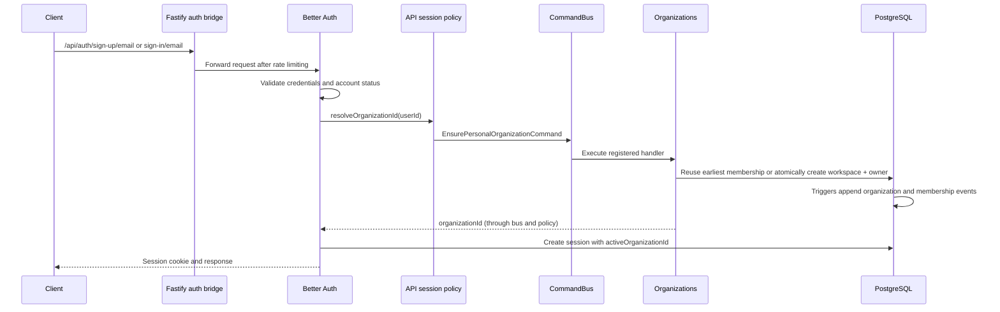

# Authentication and organization ownership

## Start here

Two request paths coexist. Better Auth owns `/api/auth/*`; Nest owns the business
API. A Nest guard does not protect Better Auth endpoints.

| Responsibility                                   | Owner                             | Entry point                                                             |
| ------------------------------------------------ | --------------------------------- | ----------------------------------------------------------------------- |
| Credentials, OAuth accounts, session persistence | Better Auth                       | `libs/infra/auth/src/lib/better-auth.config.ts`                         |
| Active-account checks on auth endpoints          | Auth adapter                      | `hooks.before` and `databaseHooks.session.create.before` in that config |
| Initial organization for a new session           | Organizations application command | `EnsurePersonalOrganizationCommand`                                     |
| Connect session creation to the command          | API composition                   | `apps/api/src/common/auth/authentication.module.ts`                     |
| Authenticate REST and GraphQL requests           | Auth guard                        | `libs/infra/auth/src/lib/better-auth.guard.ts`                          |
| Tenant business permissions                      | Authorization adapter             | `libs/infra/authorization`                                              |
| Organization plugin endpoint permissions         | Better Auth organization plugin   | `organization-access-control.ts`                                        |
| Durable events for auth-owned tables             | PostgreSQL triggers               | `prisma/migrations/20260501000000_init/migration.sql`                   |

## Sign-up and sign-in

The hook remains synchronous: a successful session must already have an initial
organization. Moving provisioning to an asynchronous listener would introduce a
window in which login succeeds but tenant endpoints cannot run.

The handler owns the default name and slug. The repository reads from the primary,
takes a per-user transaction advisory lock and checks membership again before
creating anything. Concurrent initial sessions therefore converge on one
organization. Any existing membership is reused, even a non-owner membership.

Organization and owner creation are atomic with their trigger-generated outbox
rows. They are **not** atomic with Better Auth's subsequent session insert. A
failed session insert may leave a workspace; the next attempt reuses it. The
command must not publish duplicate organization events through OutboxPublisher.

## Authenticated business request

`ApiKeyGuard` handles eligible machine routes. For session callers,
`BetterAuthGuard` loads an authoritative session, checks account status and
resolves membership. `RolesGuard` applies provider-staff roles;
`PermissionGuard` applies tenant permissions. Controllers dispatch commands or
queries after these checks. WebSocket authentication has a separate adapter in
`apps/api/src/websocket/ws-auth.adapter.ts`.

The auth HTTP bridge in `main.ts` owns the rate limits, timeout, header forwarding
and error normalization needed by its hijacked responses. Nest interceptors and
guards must not be assumed to run on that path.

## Current authorization boundary

Better Auth still owns organization-plugin mutations, including invitations and
memberships. Business endpoints use Postgres PBAC. Both derive system roles from
the shared permission catalog and use the same custom-role representation.
`organization-access-control-parity.spec.ts` checks catalog and serialization
parity; endpoint and authorization tests remain necessary for runtime behavior.

This change moves only personal-workspace provisioning into Organizations. It
does not migrate the organization plugin or claim that there is one permission
engine. Such a migration must account for invitation verification, ownership
transfer, role escalation, tenant isolation, client API contracts and existing
outbox triggers.

## Reading and testing the change

1. Read `AuthenticationModule` to see which business policy session creation calls.
2. Read `EnsurePersonalOrganizationHandler` for the provisioning decision.
3. Read `PrismaPersonalOrganizationRepository` for concurrency and persistence.
4. Read its integration suite for creation, reuse, concurrency and rollback.
5. Read `apps/api/e2e/organizations.e2e-spec.ts` for session wiring and outbox behavior.

No credentials, session format, endpoint contract or database migration changes
are required by this refactor.
